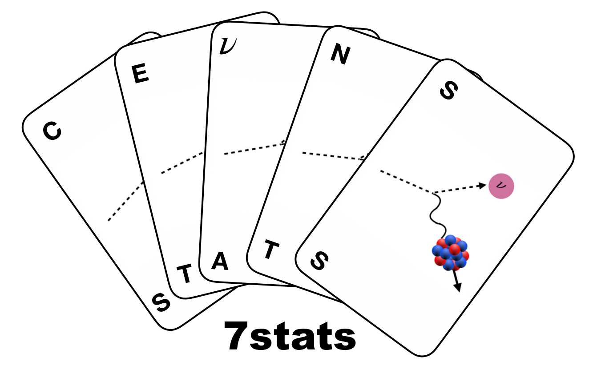

  
# 7stats 
 
| arXiv |
|:-----:|
||

## Introduction

`7stats` is a tool which allows for the calculation of the p value and confidence levels using a Feldmann-Cousins approach for standard and new physics scenarios for the CEvNS process.
As an explicit example we demonstrate the p value calculation with a Monte Carlo simulation for the SM, and the calculation of confidence levels with the FC approach 
for neutrino non-standard interactions with a heavy mediator (mass above 100 MeV) using the COHERENT CsI data.

## Usage
The code is written in python3, numpy and scipy are needed for the calculations.

The data files for the COHERENT CsI data are included as well. If you use this data please cite 
`Science 357 (2017) no.6356, 1123-1126,[arXiv:1708.01294 [nucl-ex]] `
and `arXiv:1804.09459 [nucl-ex]`.

## Example code

### Auxillary code
There are three code files which contain auxillary functions needed to calculate the number of CEvNS signal events at COHERENT CsI. 

`cevns.py` contains the functions specific to the CEvNS process like the cross section for heavy NSI mediators.

`cevns_accelerators.py` contains the funtions which are specific to CEvNS from SNS neutrinos like the energy structure of the different neutrino flavors coming 
from the SNS beam, the function used for photoelectron smearing, the CsI detector efficiency and functions needed for the background treatment.

`coherent_CsI_real.py` contains the functions which calculate the signal at COHERENT CsI, apply the dector efficiency, or rebin the data to the desired number of bins. It also contains the functions to calculate the test statistic.

### 	MC simulation
The file `FC_analysis_nsi_eeonly_12t12e_nomarg_newpull.py`
demonstrates the calculation of the test statistic using 144 bins, asymmetric pull terms to obtain a PDF of TS. The example is for only non-zero eps_ee^V, however it can be trivially applied to other cases as well.

The file `analysis_code_pval_sm_12t12e.py` demonstrates the Monte Carlo
simulation which is used to calculate the p value of the SM using 144 bins. The change to a different bin configuration is trivial. 

## Results 
For convience we include the datafiles containing the results of the MC estimation of the confidence levels using a FC approach for only non-zero eps_ee^V and eps_mm^V using 144 bins. These files can be found in the 
`datafiles_out` folder 
The first column is the value of the NSI parameter, the second column is the C.L. in percent.

## Bugs and Features
If any bugs are identified or any features suggested, please use the tools (issues, pull requests, etc.) on github.

## Reference
If you use this code please reference **[arXiv:2008.06062](https://arxiv.org/pdf/2008.06062.pdf)**

